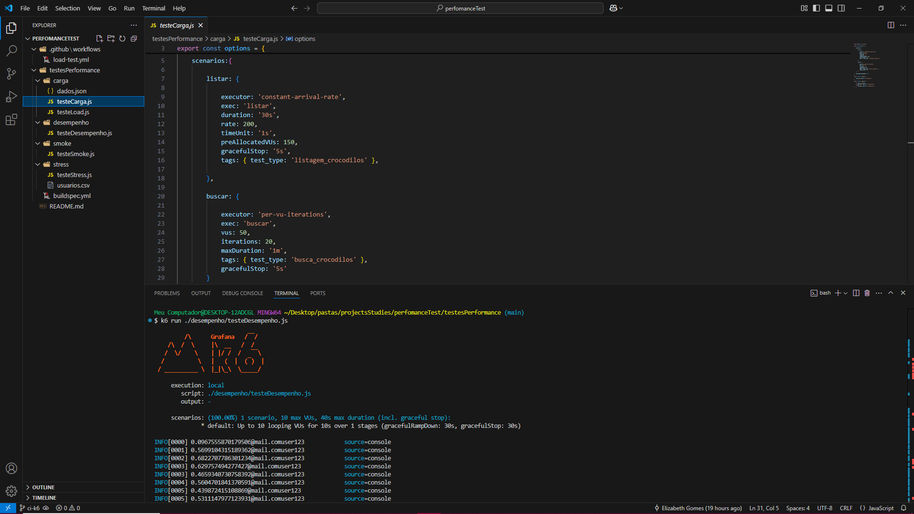

# Teste Perfomance K6



# Testes de Desempenho, Carga, Smoke e Stress
Este repositório contém um conjunto de testes abrangentes projetados para avaliar o desempenho e a confiabilidade do sistema em diferentes cenários para o back-end da API. Os testes implementados incluem:

**Teste de Desempenho**
Este teste tem como objetivo medir o tempo de resposta, a taxa de transferência e a utilização de recursos do sistema sob condições normais de operação. Os resultados fornecem insights sobre a capacidade do sistema de lidar com a carga esperada de usuários e transações, além de identificar possíveis gargalos e áreas de otimização.

**Teste de Carga**
Simula um número crescente de usuários acessando o sistema simultaneamente para determinar o ponto em que o desempenho começa a degradar ou o sistema falha. Os resultados ajudam a identificar os limites de capacidade do sistema e a entender como ele se comporta sob condições de carga máxima.

**Teste de Fumaça (Smoke Test)**
Rápido e superficial verifica as funcionalidades básicas do sistema para garantir que ele esteja funcionando corretamente após uma nova versão ou alteração. O teste de fumaça é executado em um ambiente de teste para identificar problemas críticos precocemente e evitar que sejam propagados para ambientes de produção.

**Teste de Stress**
Submete o sistema a condições extremas de carga, como um número muito alto de usuários ou transações, para identificar seus pontos fracos e determinar como ele se recupera de falhas. Os resultados ajudam a garantir que o sistema seja resiliente e capaz de lidar com situações inesperadas.


## ✅ Pre Requisitos

> **💡 NOTA:**
> 
> È necessário ter o [k6](https://grafana.com/docs/k6/latest/set-up/install-k6/)  instalado


## 📝 Passo a Passo para Instalação


**1.** **Clone o repositório na sua maquina 🖥️**

```bash
git clone https://github.com/ElizabethGomes-QAEngineer/Teste-Perfomance-K6.git
```

**2.** **Navegue até o diretório do projeto 📂**

```bash
cd perfomanceTest/testesPerformance
```


**4.** **Execute o K6 para rodar os testes 🚀**


```bash
k6 run ./carga/testeCarga.js
```

```bash
k6 run ./carga/testeLoad.js
```

```bash
k6 run ./smoke/testeSmoke.js
```


```bash
k6 run ./desempenho/testeDesempenho.js
```

```bash
k6 run ./stress/testeStress.js
```

>
>**📜 ** **Nota** Este Projeto possui **CI Smoke Teste Performance k6***:
>Acessando CI através da branch **"ci-k6"**
>clicar em ***github/workflows**
>clicar em git hub **"action**
